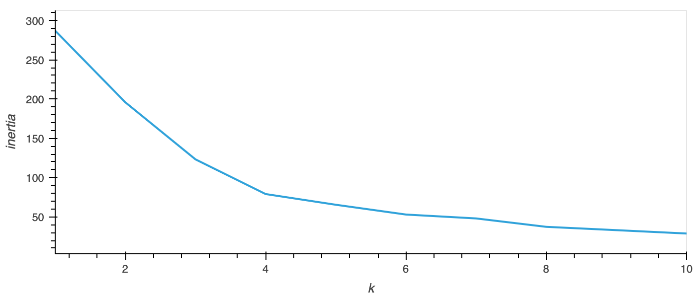
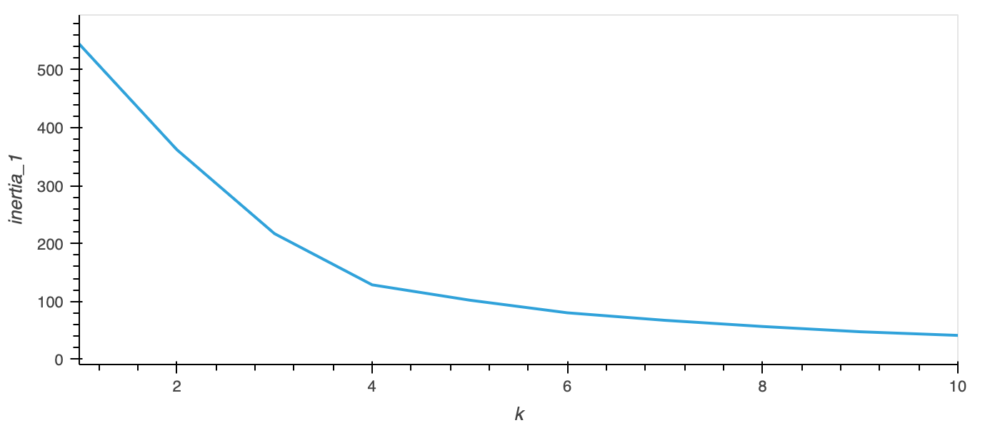
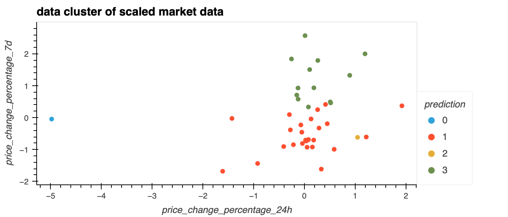
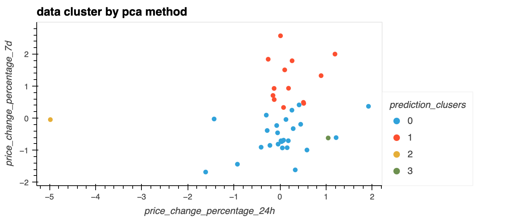

# Challenge_10 Crypto Clustering

## Overview: 
The market data of 40 crypto currencies are studied with unsupervised learning. Two unsupervised learning methods were used. The data was first scaled with StandardScaler(). The first method was using KMeans. The second method was PCA.

The n_cluster value for both methods are 4. And they output a very similar result. 

### Elbow curve 

Elbow curve for KMeans data without optimisation. 

 

Elbow curve for KMeans data with optimisation. 

### Cluster data

Cluster data plot for KMeans data without optimisation. 

Cluster data plot for KMeans data with optimisation. 

